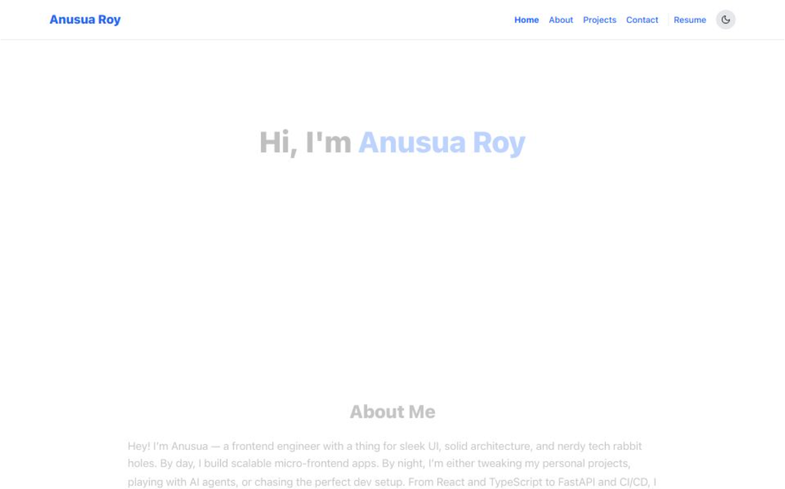

# 🧠 Anusua Roy – Developer Portfolio


A sleek and responsive developer portfolio built with **Next.js**, **Tailwind CSS**, and **Framer Motion**, featuring:

- 🌗 Dark mode with CSS variables
- 📂 Dynamic project showcase powered by `data.ts`
- 🧠 Custom GPT integration (NodeReact Studio)
- 📫 Contact form with success feedback
- 🧩 Reusable components & theme toggle
- ✅ Deployed on Vercel

---

## 🚀 Live Site

[🔗 Visit Portfolio](https://my-portfolio-anusua-roys-projects.vercel.app)

---

## 🛠️ Tech Stack

- [Next.js](https://nextjs.org/)
- [Tailwind CSS](https://tailwindcss.com/)
- [Framer Motion](https://www.framer.com/motion/)
- [React Hook Form](https://react-hook-form.com/)
- CSS Variables for theming

---

## 📸 Preview



---

## 📁 Project Structure

```
├── public/             # Assets (favicon, OG image)
├── src/
│   ├── app/            # Components for App based Routing
│   ├── components/     # Reusable Components
│   ├── lib/data.tsx     # Centralized content
│   ├── hooks/
└── ...
```

---

## 📬 Contact Me

- GitHub: [@anusua-roy](https://github.com/anusua-roy)
- LinkedIn: [Anusua Roy](https://linkedin.com/in/anusua-roy)

---

## 📄 License

This project is open source under the [MIT License](LICENSE).
